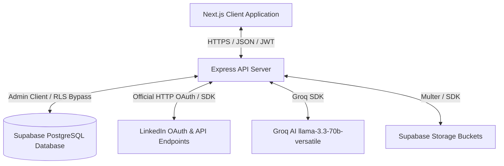
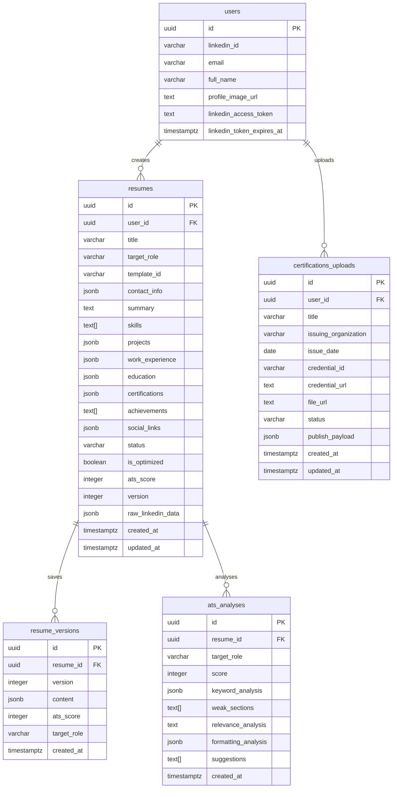
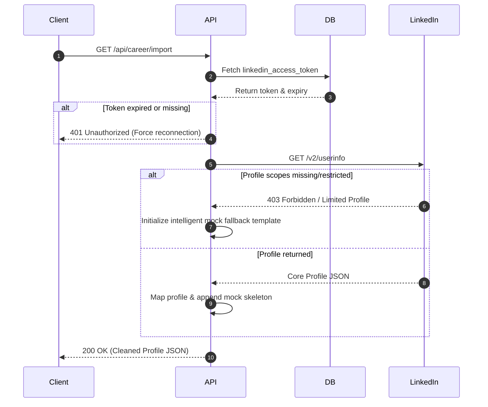
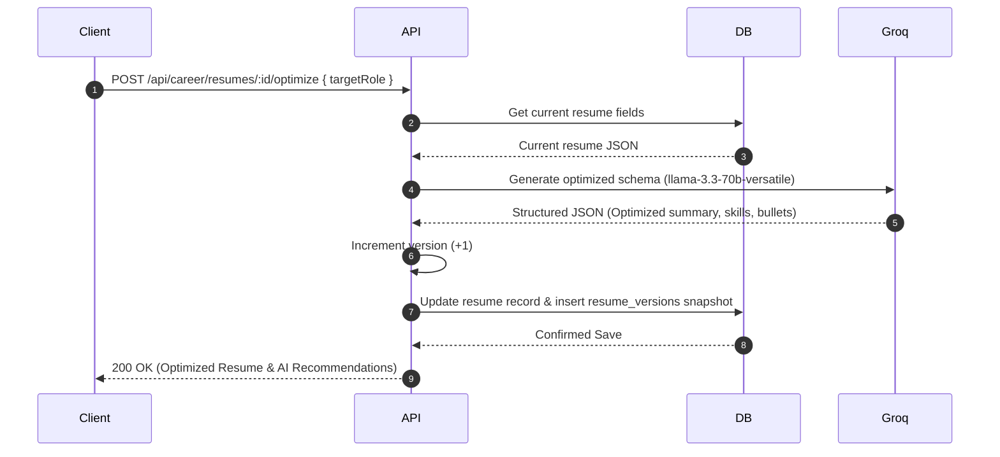
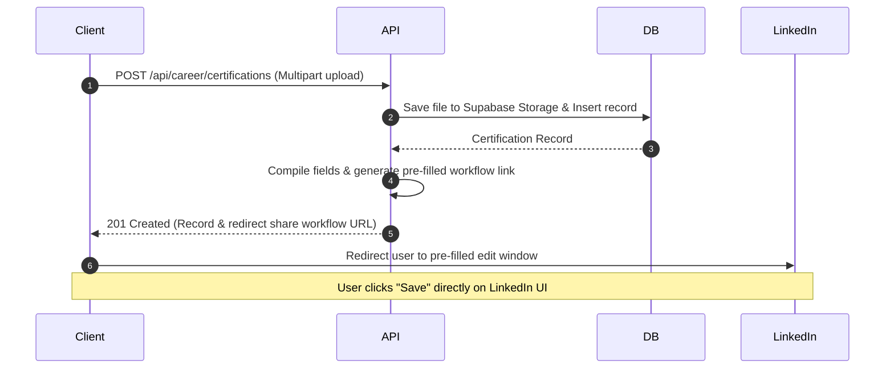

# LinkedIn Resume & Career Automation: Technical Architecture

This document describes the technical architecture, database designs, module relationships, and API flows for the LinkedIn Resume & Career Automation system.

---

## 1. System Architecture

The Career Automation features are integrated directly into the multi-tenant SaaS application backend. The platform provides data isolation between tenants via Postgres Row-Level Security (RLS) policies.



### Security & Data Isolation
- **Authentication**: JWT token-based verification via a secure cookies or Bearer tokens.
- **Isolation**: Every table is mapped with row-level security (RLS) constraints matching `auth.uid() = user_id`.
- **Throttling**: Stricter rate limiting applied on Groq-powered AI optimization and analysis endpoints via `express-rate-limit`.

---

## 2. Module Structure

```
backend/
├── src/
│   ├── config/
│   │   ├── env.js                # Environment credentials & endpoints
│   │   └── supabase.js           # Admin and public Supabase clients
│   ├── middleware/
│   │   ├── auth.js               # User session & tenant verification
│   │   └── validate.js           # Input validation utilizing Zod
│   ├── routes/
│   │   └── career.routes.js      # REST API endpoints mapping
│   ├── services/
│   │   ├── linkedin-import.service.js   # Profile import handlers
│   │   ├── resume.service.js     # Version management, optimization & CRUD
│   │   ├── ats.service.js        # Groq-based ATS parsing & grading
│   │   └── certification.service.js # Media uploads and certification pipelines
│   └── server.js                 # Global routing and middleware initialization
```

---

## 3. Database Schema

All tables enforce structural referential integrity linked directly to the parent `users` table.



---

## 4. API Flow Diagrams

### LinkedIn Profile Import Workflow

When the user initiates a LinkedIn sync:



### Resume Target Role Optimization

When optimizing bullet points, skills, and summaries for a specific job:



### Certification Upload & LinkedIn Publishing

Due to API constraints on write-scopes for general developer profiles, the system employs a robust fallback:



---

## 5. API Reference

### 1. Import Profile
- **Endpoint**: `GET /api/career/import`
- **Response (200 OK)**:
```json
{
  "success": true,
  "data": {
    "fullName": "Jane Doe",
    "email": "jane.doe@example.com",
    "profilePicture": "https://media.licdn.com/dms/image/...",
    "headline": "Software Engineer at TechCorp",
    "about": "Experience building web systems...",
    "experience": [
      {
        "id": "exp_1",
        "companyName": "TechCorp",
        "jobTitle": "Software Engineer",
        "startDate": "2023-01-01",
        "endDate": null,
        "current": true,
        "location": "Remote",
        "description": "Implemented web APIs..."
      }
    ],
    "skills": ["JavaScript", "React", "Node.js"],
    "certifications": [],
    "achievements": []
  }
}
```

### 2. Update Resume (Automatic Versioning)
- **Endpoint**: `PATCH /api/career/resumes/:id`
- **Request Body**: Partial resume fields.
- **Response (200 OK)**:
```json
{
  "success": true,
  "data": {
    "id": "res_uuid_123",
    "version": 4,
    "title": "Jane's Core Resume",
    "summary": "Optimized developer summary...",
    "updated_at": "2026-05-20T12:00:00Z"
  }
}
```

### 3. AI Target Role Optimization
- **Endpoint**: `POST /api/career/resumes/:id/optimize`
- **Request Body**:
```json
{
  "targetRole": "AI Engineer"
}
```
- **Response (200 OK)**:
```json
{
  "success": true,
  "data": {
    "resume": {
      "id": "res_uuid_123",
      "version": 5,
      "is_optimized": true,
      "summary": "AI Engineer with experience fine-tuning models...",
      "skills": ["PyTorch", "Python", "JavaScript", "NLP"]
    },
    "suggestedImprovements": [
      "Highlight specific projects involving LLMs or Groq integrations."
    ],
    "missingSkills": ["PyTorch", "LLMOps"]
  }
}
```

### 4. ATS Scoring & Audit Report
- **Endpoint**: `POST /api/career/resumes/:id/ats`
- **Request Body**:
```json
{
  "targetRole": "AI Engineer"
}
```
- **Response (200 OK)**:
```json
{
  "success": true,
  "data": {
    "analysis": {
      "id": "ats_analysis_uuid",
      "score": 82,
      "keyword_analysis": {
        "matched": ["Python", "Transformers"],
        "missing": ["CUDA", "TensorFlow"]
      },
      "weak_sections": ["projects"],
      "relevance_analysis": "Highly relevant for general ML but lacks deep hardware engineering projects.",
      "formatting_analysis": {
        "readability": "Good",
        "bulletPoints": "Action-oriented bullet points verified."
      },
      "suggestions": [
        "Include quantitative performance metrics for GPU throughput optimizations."
      ]
    }
  }
}
```

### 5. Upload Certification
- **Endpoint**: `POST /api/career/certifications`
- **Request (Multipart Form)**:
  - `file`: certification image or PDF
  - `title`: "AWS Solutions Architect"
  - `issuingOrganization`: "Amazon Web Services"
  - `issueDate`: "2026-01-15"
- **Response (201 Created)**:
```json
{
  "success": true,
  "data": {
    "certification": {
      "id": "cert_uuid_456",
      "title": "AWS Solutions Architect",
      "file_url": "https://supabase-bucket-url/certifications/...",
      "status": "pending"
    },
    "sharingUrl": "https://www.linkedin.com/profile/add?startTask=CERTIFICATION&name=AWS+Solutions+Architect&organizationName=Amazon+Web+Services&issueMonth=1&issueYear=2026"
  }
}
```
