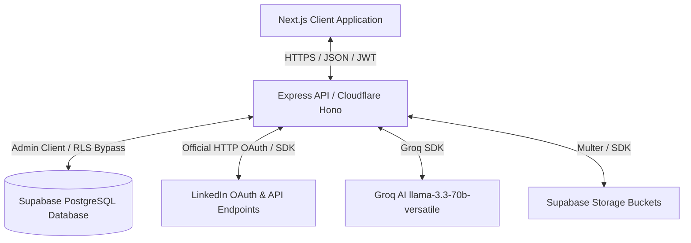
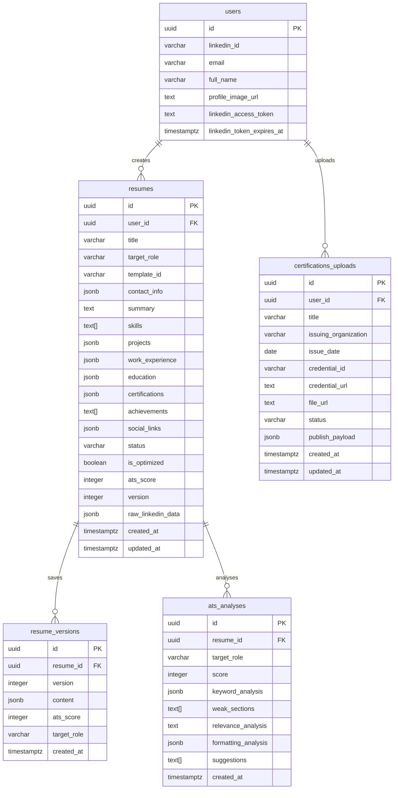

# 🛠️ Lyra Suite (LinkForge AI) — Ultimate LinkedIn Automation & Career SaaS

[](#)
[](#)
[](#)
[](#)
[](#)

Lyra Suite (LinkForge AI) is a secure, multi-tenant SaaS application designed to unify **LinkedIn content marketing**, **post scheduling**, **engagement analytics**, and **career optimization** (including profile imports, A4 resume builders, real-time AI optimization, ATS keyword gap analysis, and LinkedIn certification vaults).

---

## 🌟 Core Philosophy: What Lyra Suite Solves

In the modern professional landscape, career growth and personal branding are deeply interconnected. An outstanding resume is less effective if you have no industry presence, and a high-profile industry presence won't translate to career growth if your professional credentials (resumes, portfolios) fail to pass automated ATS filters or recruitment queries.

**Lyra Suite** bridges this gap by uniting **Content Authority** and **Career Readiness** into a single, unified, and secure workspace.

### 💡 How It Is Helpful
* **Saves Hundreds of Hours**: Rather than context-switching between disjointed tools (like Buffer for scheduling, external LLM chats for copywriting, external sites for resume analysis, and manually filling LinkedIn forms), Lyra Suite handles the entire flow.
* **Intelligent Profile Bootstrapping**: Syncs directly with your LinkedIn profile to automatically extract and populate resume skeletons, saving you from manual data entry.
* **Bypasses Automatic Filters**: Translates plain experience statements into powerful, quantitative STAR-method achievements, matching relevant keywords to beat automated HR screening bots.
* **Zero-Friction Credential Shares**: Stores certification credentials securely on the cloud and generates customized LinkedIn add-profile shortcuts.

### 📈 What It Will Improve
1. **Audience Reach & Brand Authority**: Regular publishing at optimized intervals boosts your ranking on the LinkedIn algorithm, increasing organic visibility and networking opportunities.
2. **Resume Match Rates**: Optimizing resume keywords against target job descriptions raises ATS grades from "Unfavorable" to "Elite Compatibility."
3. **Data Security & Isolation**: Fully sandboxed drafts, version histories, and documents isolated per tenant utilizing Supabase RLS (Row-Level Security) ensure absolute confidentiality.

---

## 🚀 Key Modules & Features

### 1. ✍️ Content & Scheduling Suite
* **AI Post Generator**: Leverages `llama-3.3-70b-versatile` to craft highly-engaging LinkedIn posts based on custom tone, length, and industry guidelines.
* **Smart Queue & Scheduler**: Plan, reschedule, queue, and manage posts. Backed by **Bull Queue** and **Redis** for robust, non-blocking background task executions.
* **Engagement Analytics**: Gain visual clarity on performance over time (likes, impressions, and click patterns) using dynamic **Recharts** charts.

### 2. 💼 Career & Resume Optimization Suite
* **LinkedIn Profile Sync**: Instantly parse profile exports and CVs, merging details into a primary resume document.
* **ATS Scoring & Audit**: Run an automated ATS compatibility check using AI. Detects missing keywords, identifies formatting/content bottlenecks, and suggests action points.
* **Resume Version Control**: Automatically saves document snapshots on every edit. Tracks improvements, version changes, and target roles dynamically over time.
* **STAR-Method Optimizer**: Refines summaries and formats bullet points using the Situation, Task, Action, Result (STAR) methodology.
* **Certification Vault & Sync**: Upload certifications (images/PDFs) with automatic metadata extraction. Generates pre-filled share URLs to seamlessly publish credentials to your LinkedIn profile.

### 3. 📱 Premium Mobile Responsive Workspace
* **Dynamic A4 Scaling**: Resumes scale down mathematically on mobile viewports using CSS variable properties to prevent horizontal scrolling or layouts overflowing the screen.
* **Swipeable Tab Navigation**: Section tabs in the Career Hub scroll horizontally in a native-app style scroller.
* **Compact Controls**: Action buttons and template selectors are rendered in tight mobile grids (e.g. 2x2 grids and horizontal rows) to maximize vertical content space.
* **Slide-over AI Chat Panel**: The AI Strategist interface slides out from the right edge as a fixed overlay drawer on mobile rather than stacking at the bottom.

---

## 🛠️ Tech Stack & System Architecture

The platform is designed to run locally on a Node.js Express server or scale serverless globally on the Cloudflare Edge runtime (V8 engine).



### **Database ER Diagram**
All transactions and entities enforce structural referential integrity linked directly to the parent `users` table:



---

## 📂 Project Structure

```
linkedin_connector/
├── backend/                  # Node.js + Express API Server / Cloudflare Worker
│   ├── src/
│   │   ├── config/           # Supabase & Env configurations
│   │   ├── middleware/       # JWT Auth & Zod Schema Validation
│   │   ├── routes/           # Router groups (auth, posts, career, etc.)
│   │   ├── services/         # Core business logic (ATS, Resume, Queues)
│   │   └── worker.js         # Cloudflare Worker Entrypoint (Hono app)
│   └── package.json
├── frontend/                 # Next.js 16 Web Application
│   ├── app/                  # App Router Pages (dashboard, career, posts, etc.)
│   ├── components/           # Reusable UI component library
│   ├── lib/                  # Shared API/Fetch helpers
│   └── package.json
├── supabase/
│   └── migrations/           # Database schema migration files
├── .env.example              # Global environment template
└── README.md
```

---

## 🚦 Getting Started (Local Development)

### 📋 Prerequisites
* **Node.js** (v18 or higher)
* **Redis Server** (required for post scheduling queues; runs on `6379` by default)
* **Supabase** Project (either local instance or cloud hosted database)

### ⚙️ Step 1: Environment Configuration
Copy the template `.env.example` to `.env` in the root folder:
```bash
cp .env.example .env
```
Fill out the required API credentials:
* **Supabase**: `SUPABASE_URL` and `SUPABASE_SERVICE_ROLE_KEY`.
* **LinkedIn OAuth**: `LINKEDIN_CLIENT_ID`, `LINKEDIN_CLIENT_SECRET`, and `LINKEDIN_REDIRECT_URI`.
* **AI Providers**: `GROK_API_KEY` (xAI) and `GEMINI_API_KEY` (Google AI).

### 🗄️ Step 2: Database Setup
Apply the schema migration to your Supabase instance:
```bash
supabase/migrations/001_initial_schema.sql
```
This script creates tables, configures indexes, and sets up Postgres Row-Level Security (RLS) policies.

### 📦 Step 3: Installation & Execution

#### Terminal 1: Backend Server
```bash
cd backend
npm install
npm run dev
```
*API server runs at http://localhost:5000*

#### Terminal 2: Frontend Web App
```bash
cd frontend
npm install
npm run dev
```
*Web application runs at http://localhost:3000*

---

## ☁️ Cloudflare Edge Deployment (Production Edge Setup)

For production, the application is designed to compile directly into a serverless **Cloudflare Edge Worker** and **Cloudflare Pages** site to eliminate cold starts and scale globally.

### **Production Architecture Optimizations**
1. **Gemini 1.5 Flash Document Processing**: Removed native Node.js binaries (`pdf-parse` and tesseract compiled OCR libraries) and replaced them with direct, lightweight multimodal **Gemini 1.5 Flash** API calls. This enables document extraction and OCR directly on the serverless edge.
2. **Transparent Environment Proxy**: Wrapped database clients and global configuration in Javascript `Proxy` instances. Clients are initialized lazily inside the Cloudflare Worker request context (`c.env`) dynamically.
3. **Cross-Domain Token Authentication**: Standard browsers block third-party cookies across differing domains (`pages.dev` to `workers.dev`). To bypass this, the backend OAuth redirect passes tokens via query parameters (`accessToken` & `refreshToken`) which the frontend securely extracts, cleanses from the address bar (via `window.history.replaceState`), stores in `localStorage`, and sends via the `Authorization: Bearer <token>` header on subsequent requests.
4. **Hono Router**: The Worker is powered by a high-performance **Hono** router ([worker.js](file:///c:/veer/project/linkedin_connector/backend/src/worker.js)) handling request routing and multipart/form-data buffering transparently.

### 🚀 Production Deployment Commands

#### 1. Deploy the Backend Worker
1. Configure bindings in `backend/wrangler.toml` using placeholder URLs for production.
2. Set production secrets in wrangler:
   ```bash
   npx wrangler secret put SUPABASE_SERVICE_ROLE_KEY
   npx wrangler secret put GROQ_API_KEY
   npx wrangler secret put GEMINI_API_KEY
   npx wrangler secret put JWT_SECRET
   npx wrangler secret put LINKEDIN_CLIENT_SECRET
   ```
3. Deploy:
   ```bash
   cd backend
   npx wrangler deploy
   ```

#### 2. Deploy the Frontend Pages
1. Configure `frontend/.env.local` to point to the deployed Worker endpoint.
2. Build the Next.js static output:
   ```bash
   cd frontend
   npm run build
   ```
3. Deploy to Pages:
   ```bash
   npx wrangler pages deploy out --project-name linkedin-connector-frontend
   ```

---

## 🔒 Security & Data Privacy
All database transactions are guarded by Supabase RLS. The backend verifies the user ID extracted from JWT tokens, ensuring that no tenant can read, modify, or delete another user's draft content, resume edits, certifications, or ATS analysis logs.